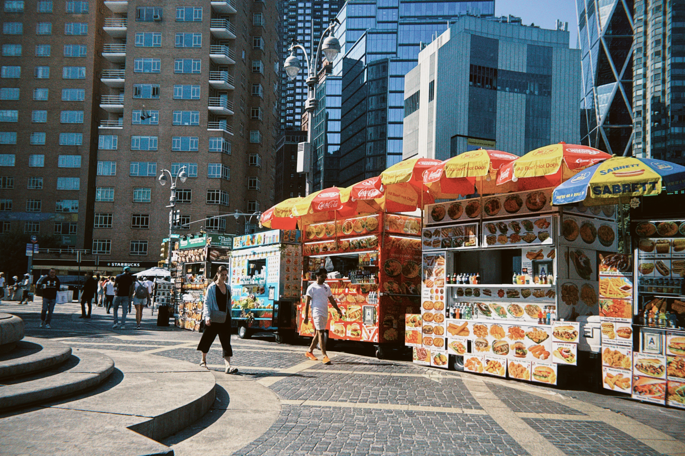

Hello! I'm Fengwei Lei, a graduate student from **China** currently pursuing a degree in **Biostatistics** at **Columbia University**. I have a keen interest in photography and love exploring the beauty of the world around me.

## Who I Am

As a dedicated graduate student, I am committed to expanding my knowledge and skills in biostatistics. My educational journey has been enriched by diverse experiences, shaping my perspective and fueling my passion for continuous learning. Studying at Columbia has allowed me to engage with innovative research and collaborate with talented individuals in my field.

## My Interests

Photography is one of my greatest passions. I enjoy capturing moments that tell a story, whether it's the vibrant colors of nature, the energy of urban life, or the essence of the people I meet along the way. I love experimenting with different styles and techniques to express my creativity. In addition to photography, I enjoy visiting parks, where I find inspiration for my artistic vision and a sense of tranquility.

## What Drives Me

What drives me is the desire to capture and share experiences through my lens. I believe that photography allows us to freeze time and preserve memories. My goal is to inspire others to appreciate the beauty in everyday life and encourage them to see the world from different perspectives. Additionally, my studies in biostatistics motivate me to use data to address real-world health issues, merging my analytical skills with my passion for storytelling through images.

## Photos

Here are some of my favorite photographs:

<table>
  <tr>
    <td style="text-align: center;">
      
      
<strong>Nature Shot</strong>

    </td>
  </tr>
  <tr>
    <td style="text-align: center;">
      
      
<strong>Urban Landscape</strong>

    </td>
  </tr>
  <tr>
    <td style="text-align: center;">
      
      
<strong>Park Visit</strong>

    </td>
  </tr>
</table>